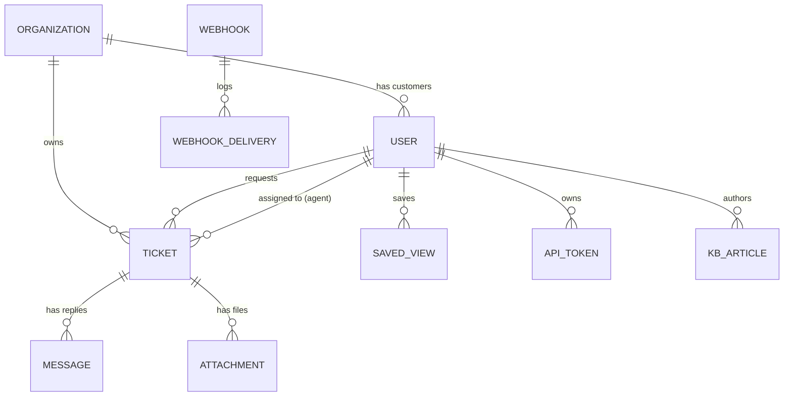

# Rampart Lab Guide

Rampart is a small support-desk product. It works — and it's broken in exactly ten ways,
one per **OWASP Top 10:2025** category. For each one you'll find it, prove it's real, then
fix it and lock the fix in with a test. Ten exercises, self-contained, in the 2025 order.

Working solo? Good — every hint ladder's **rung 3 spells out the exploit**, every exercise
tells you exactly how you'll know you succeeded, and nothing here needs a facilitator.

---

## Reset — read this first

You **will** wreck the data (SQL injection and privilege escalation aren't gentle).
Restoring costs nothing:

```
make reset        # re-seed to the exact starting state — same IDs, same users — in seconds
make reset-hard   # if the app itself is wedged: wipe the DB volume and re-provision
```

Say `make reset` out loud before you start. It's the single most useful command here.

---

## Getting started

**Before a workshop:** run `docker compose build` once on home/venue wifi (or `make load`
the USB image) — don't first-build on conference wifi with forty other people.

```
docker compose up
```

Open <http://localhost:8080>. Seeded sign-ins:

| Role | Email | Password |
|---|---|---|
| Admin | `admin@rampart.test` | `admin` |
| Agent | `priya@rampart.test` | `password123` |
| Customer | *register your own, or crack one (Exercise A04)* | — |

`docs/wordlist.txt` is generated from the real seeded hashes — it cracks the admin, all
agents, and a third of customers.

## The domain, at a glance



Three roles: **customer** (files tickets, replies, manages their own profile), **agent**
(sees/answers all tickets, can leave internal notes customers shouldn't see), **admin**
(users, webhooks, settings).

---

## Your toolkit

A few exercises go beyond clicking around. Here's everything you'll need:

- **The browser is your main weapon.** While you're logged in it sends your session cookie
  and CSRF token automatically — most exploits are just a URL or a form away.
- **Tampering with a request:** open devtools → **Network**, right-click the request →
  *Edit and Resend* (Firefox) or *Copy as fetch* (Chrome), change a field, send.
- **Firing an authenticated request from the page (CSRF handled for you).** Every page
  carries `<meta name="csrf-token">`. From the devtools **Console** on any logged-in page:

  ```js
  fetch('/tickets/1/assign', {
    method: 'POST',
    headers: {
      'Content-Type': 'application/x-www-form-urlencoded',
      'X-CSRF-TOKEN': document.querySelector('meta[name=csrf-token]').content,
    },
    body: 'agent_id=does-not-exist',
  }).then(r => console.log('status', r.status));
  ```

- **A shell in the app container:** `make shell` (then `php artisan tinker` for a PHP REPL,
  or `tail -f storage/logs/laravel.log` for the logs).
- **A database prompt:** `make mysql-shell`.
- **Email:** the app's mailer writes to the log, so password-reset links land in
  `storage/logs/laravel.log`.
- **External callers:** endpoints meant for other services (the inbound webhook) take plain
  `curl` — no login, no CSRF token.

## Using the hint ladders

Try the exercise on the scenario alone first. Stuck? Open **Rung 1**. Still stuck after
really trying? **Rung 2**. **Rung 3** hands you the whole exploit — use it when you're out
of ideas or out of time, not on the first wobble.

---

### A01 — Broken Access Control

*2025: #1, unchanged as the top risk — but **SSRF is folded in here now** (it was its own
category, A10:2021). Three sub-flaws live under A01 in Rampart: an IDOR, a
privilege-escalation, and an SSRF.*

**Scenario.** Rampart trusts the person holding the URL a little too much — and trusts the
*server's own* outbound requests a lot too much.

**Start here:** your own ticket list at `/tickets`; your profile at `/profile`; and (as an
agent/admin) the "Preview" box in the Knowledge Base editor at `/kb/create`.

**Solo time:** ~20 min for all three.

<details><summary>Rung 1</summary>

- **IDOR:** open one of your tickets and look hard at the URL. What if you just… change the number?
- **Privilege escalation:** view-source your profile form. What columns does a `User` have that the form never shows you?
- **SSRF:** the KB "Preview" button fetches a URL *from the server*. What, to a server, counts as "a URL" besides `http://`?
</details>

<details><summary>Rung 2</summary>

- **IDOR:** ticket ids are small sequential integers, and nothing checks that the ticket is yours.
- **Privilege escalation:** the `User` model has a `role` column and profile updates write the whole request body straight to the model. What if your update carries a field the form didn't?
- **SSRF:** there's a service on the internal network at `metadata.internal` your browser can't reach — but the server can. And PHP's `file://` scheme reads local files.
</details>

<details><summary>Rung 3 — full walkthrough</summary>

**IDOR.** Logged in as any user, `GET /tickets/<any id>` — e.g. `/tickets/2`, `/tickets/50`.
You'll read tickets belonging to other customers and other organizations. No ownership
check runs in the ticket-detail action at all.

**Privilege escalation.** Your profile form submits `PATCH /profile` with `name` and
`email`. Add a `role` field. Easiest path: on `/profile`, devtools **Console**:

```js
fetch('/profile', {
  method: 'POST',
  headers: {'Content-Type':'application/x-www-form-urlencoded','X-CSRF-TOKEN':document.querySelector('meta[name=csrf-token]').content},
  body: '_method=PATCH&name=Me&email='+encodeURIComponent('me@example.com')+'&role=admin',
}).then(r => location.reload());
```

Reload — you're an admin (the **Admin** menu appears; `/admin/users` opens). The update
mass-assigns every field in the body, `role` included.

**SSRF.** Log in as an agent or admin, open `/kb/create`, and in the **Preview** box enter:

- `http://metadata.internal/latest/meta-data/iam/security-credentials/rampart-app-role`
  → the mock cloud-metadata service hands back (fake) AWS keys, fetched by the server.
- `file:///etc/passwd` or `file:///var/www/html/storage/app/ssrf-marker.txt` → the server
  reads a local file and shows it to you.

The preview feature fetches any URL, any scheme, with no allowlist.
</details>

**✓ You've done it when:** you can read a ticket that isn't yours; the **Admin** menu
appears after your profile update; and the Preview box shows you `AKIAFAKE…` metadata keys
or the contents of a local file.

**Add a regression test** (public suite): a customer `GET`-ing another user's ticket gets
`403`; a profile `PATCH` with `role=admin` leaves the role unchanged; the preview endpoint
rejects `file://` and internal/private hosts. See `RegressionExamples.md` for the
mass-assignment one written out.

**Fix, in one line:** authorize the object on every access (`Gate::authorize`), drop `role`
from what a profile update may set, and allowlist the preview fetch (scheme + host, block
private ranges). Cross-framework specifics: `docs/HARDENING-CHECKLIST.md` (A01).

---

### A02 — Security Misconfiguration

*2025: climbed to #2 (was A05:2021) — config and CD now drive more behavior than code does.*

**Scenario.** The app is far too honest when something goes wrong.

**Start here:** the ticket **search** box (`/tickets?q=…`). Also: notice the admin sign-in
you were handed is `admin` / `admin`.

**Solo time:** ~5 min.

<details><summary>Rung 1</summary>
Make the search endpoint throw a *real* server error (a 500, not a validation message).
What does the error page show you?
</details>

<details><summary>Rung 2</summary>
Search takes a term **and** a `sort` option, and `sort` flows into raw SQL. Feed it
something that isn't a real column name.
</details>

<details><summary>Rung 3 — full walkthrough</summary>
Logged in, visit `GET /tickets?q=x&sort=not_a_real_column`. The bad column crashes the
query, and because `APP_DEBUG=true` the error page dumps the environment — including
`DB_PASSWORD` and `APP_KEY` — straight into the response.
</details>

**✓ You've done it when:** the error page shows `DB_PASSWORD` (value `rampart`) and the app
key. (And separately: `admin`/`admin` logged you in.)

**Add a regression test:** hitting the error path in a `testing`/`production` config renders
a generic 500 with no `DB_PASSWORD`/`APP_KEY` in the body.

**Fix, in one line:** `APP_DEBUG=false` outside local dev, never render config on an error
page, and kill the default admin credentials. Cross-framework: HARDENING-CHECKLIST (A02).

---

### A03 — Software Supply Chain Failures

*2025: broadened and renamed from "Vulnerable and Outdated Components" (A06:2021) — the
whole build and distribution chain, not just stale libraries. This one is an **audit**, not
a running-app exploit.*

**Scenario.** Nothing here needs you to touch the app — the risk is in what it's built from.

**Start here:** a shell (`make shell`), the page source of any screen, and
`.github/workflows/ci.yml`.

**Solo time:** ~10 min.

<details><summary>Rung 1</summary>
Run `composer audit` in the container. View-source and find the CDN `<script>`. Skim the CI
workflow.
</details>

<details><summary>Rung 2</summary>
One pinned dependency has a published advisory. The CDN script is missing the attribute
that lets the browser detect tampering. The CI workflow names its GitHub Actions by a tag
that can be moved to point at new code.
</details>

<details><summary>Rung 3 — full walkthrough</summary>

- `make shell` then `composer audit` → it flags **firebase/php-jwt** (CVE-2025-45769). The
  build ignores it.
- View-source on any page: the Chart.js `<script src="https://cdn.jsdelivr.net/…">` has no
  `integrity=`/`crossorigin=` (no Subresource Integrity) — a compromised CDN owns your page.
- `.github/workflows/ci.yml`: `actions/checkout@v4` and `actions/setup-node@v4` are **tags**,
  not commit SHAs, and `composer install` runs without `--locked`.
</details>

**✓ You've done it when:** you can point to all three — the `composer audit` finding, the
integrity-less script tag, and the tag-pinned actions.

**Add a regression test:** this one's a CI gate, not a PHPUnit test — make CI run
`composer audit` and fail on findings.

**Fix, in one line:** audit deps in CI (fail the build), add SRI to third-party scripts,
pin actions by SHA, install `--locked`. Cross-framework: HARDENING-CHECKLIST (A03).

---

### A04 — Cryptographic Failures

*2025: #4 (was A02:2021) — same category, "used crypto wrong or not at all."*

**Scenario.** The passwords are weak — but so is what protects them.

**Start here:** the `users` table (`make mysql-shell`), and `docs/wordlist.txt`.

**Solo time:** ~10 min.

<details><summary>Rung 1</summary>
What algorithm produces a 32-character hex string? Look at the shape of a stored password.
</details>

<details><summary>Rung 2</summary>
`docs/wordlist.txt` is a candidate list. Any md5 you compute from it can be compared to the
stored hashes in seconds.
</details>

<details><summary>Rung 3 — full walkthrough</summary>

```
make mysql-shell
SELECT email, password FROM users LIMIT 5;
```

Those 32-hex strings are **plain `md5()`**. Crack one:

```
echo -n "password123" | md5sum      # -> matches priya@rampart.test
```

Log in as that user. Then look further: `SELECT token FROM api_tokens;` — stored in
cleartext. And the password-reset token is `md5(email + unix-time)` — guessable if you know
roughly when it was requested.
</details>

**✓ You've done it when:** a wordlist entry's md5 matches a stored hash and you log in as
that user; and you've seen the cleartext API tokens.

**Add a regression test:** a freshly created user's stored `password` is **not** equal to
`md5($plaintext)` (i.e. it's a real hash); a new API token isn't stored verbatim.

**Fix, in one line:** hash passwords with bcrypt/argon2id, hash tokens at rest, and generate
reset tokens from a CSPRNG with a short TTL. Cross-framework: HARDENING-CHECKLIST (A04).

---

### A05 — Injection

*2025: #5 (was A03:2021). XSS lives here too (folded into Injection back in 2021). Two
sub-flaws: SQL injection and stored XSS.*

**Scenario.** Two places take your input and hand it to an interpreter without asking.

**Start here:** the ticket **search** box; and posting a **reply** on a ticket.

**Solo time:** ~15 min.

<details><summary>Rung 1</summary>
Try a classic SQLi payload in search — it won't work first try. Think about *why*, given
your input lands inside `LIKE '%…%'`. Separately: reply to a ticket with an HTML tag that
runs JavaScript, then reopen the ticket.
</details>

<details><summary>Rung 2</summary>
**Search:** your input becomes `LIKE '%<you>%'`. Close the quote, add `OR '1'='1'`, and
comment out the rest of the statement (MySQL has a one-character comment). **XSS:** the
reply body is rendered without escaping when the ticket is viewed.
</details>

<details><summary>Rung 3 — full walkthrough</summary>

**SQLi.** Search for:

```
anything%' OR '1'='1' #
```

The `#` comments out the query's trailing `%' ORDER BY …`, and `OR '1'='1'` matches every
row — you get *all* tickets, across every organization, regardless of your search term.

**Stored XSS.** File a ticket (or open one of yours) and post a reply of:

```html
<script>alert(document.cookie)</script>
```

Reopen the ticket — it executes. The reply is rendered with Blade's raw `{!! !!}`. Because
the session cookie isn't `HttpOnly`, `document.cookie` includes it, so a real payload could
steal an agent's session when *they* open the ticket.
</details>

**✓ You've done it when:** a search whose term matches nothing still returns every ticket;
and your `<script>` reply pops an alert (showing the session cookie) on view.

**Add a regression test:** a search for `' OR '1'='1` returns only true subject matches
(none, for a nonsense term); a stored `<script>` reply comes back **escaped** in the HTML.

**Fix, in one line:** parameter-bind the query (and whitelist `sort`), escape output with
`{{ }}`, and set `HttpOnly` on the session cookie. Cross-framework: HARDENING-CHECKLIST (A05).

---

### A06 — Insecure Design

*2025: #6 (was A04:2021) — flaws in the plan, not the code. Rampart has three.*

**Scenario.** No single line is "the bug" — the *design* leaks information and trusts the
wrong side.

**Start here:** the "forgot password" form (`/forgot-password`); the login form; and the
reply form on a ticket you own.

**Solo time:** ~15 min.

<details><summary>Rung 1</summary>
Request a reset for an email that exists, then one that doesn't — compare the responses.
Separately, look at the hidden fields on a ticket's reply form.
</details>

<details><summary>Rung 2</summary>
The reset flow tells you outright whether an account exists (enumeration). And the reply
form carries a hidden `can_view_internal_notes` field — what if a customer submits it set to
`1`? (Bonus: the login lockout is per-account only, so a slow spray across many accounts
never trips it.)
</details>

<details><summary>Rung 3 — full walkthrough</summary>

**Enumeration.** `POST /forgot-password` with `admin@rampart.test` → "We have emailed your
password reset link." With `nobody@nowhere.test` → "We can't find a user with that email."
Two different answers = you can enumerate valid accounts.

**Client-trusted authorization.** Internal notes are staff-only. Reproduce end-to-end:
1. Register a throwaway customer at `/register` and file a ticket.
2. Log in as `admin`/`admin`, open that ticket, post a reply with **"Internal note" ticked**.
3. Log back in as your customer and open the ticket — the note is hidden. Now append
   `?can_view_internal_notes=1` to the ticket URL — the staff-only note appears. The server
   trusts the request parameter instead of recomputing it from your role.
</details>

**✓ You've done it when:** the two reset responses differ; and a customer sees a staff-only
internal note by adding `?can_view_internal_notes=1` to the ticket URL.

**Add a regression test:** the reset response is byte-identical for known vs. unknown
emails; a customer's ticket view never includes internal notes regardless of query params.

**Fix, in one line:** identical reset responses, recompute the internal-notes flag
server-side from the authenticated user, and rate-limit on more than one dimension.
Cross-framework: HARDENING-CHECKLIST (A06).

---

### A07 — Authentication Failures

*2025: renamed from "Identification and Authentication Failures" (A07:2021). Login,
"remember me," and reset each have a problem.*

**Scenario.** The auth mechanics look normal and are quietly forgeable.

**Start here:** the login form (watch your cookies in devtools → Application → Cookies), the
"Remember me" checkbox, and a password-reset link.

**Solo time:** ~15 min.

<details><summary>Rung 1</summary>
Note your `rampart-session` cookie value before and after login. Log in with "Remember me"
and decode the cookie it sets. Use a reset link twice.
</details>

<details><summary>Rung 2</summary>
The session id should change when you log in (it doesn't). The remember-me cookie decodes to
something very short and guessable. The reset token never expires and isn't consumed on use.
</details>

<details><summary>Rung 3 — full walkthrough</summary>

**Session fixation.** Watch `rampart-session` in devtools across a login — the value is
**unchanged**. The app never calls `session()->regenerate()`, so a session id planted in a
victim's browser before login stays valid (and now authenticated) after.

**Forged remember-me.** Log in with "Remember me" and look at the `remember_me` cookie:
it's `base64(user_id)`. So set it yourself — in devtools → Console:

```js
document.cookie = 'remember_me=' + btoa('1') + '; path=/';   // btoa('1') === 'MQ=='
```

Load `/dashboard` in a fresh/logged-out session with that cookie → you're user #1, the
admin. The cookie is trusted with no signature.

**Reusable reset token.** Request a reset, grab the link from `storage/logs/laravel.log`
(`make shell` → `grep reset-password storage/logs/laravel.log`), and use it to set a
password — twice. It works both times; the token never expires and is never consumed.
</details>

**✓ You've done it when:** the session cookie is identical across login; setting
`remember_me=MQ==` logs you in as the admin; and one reset link works more than once.

**Add a regression test:** the session id differs before vs. after login; a forged
`remember_me` cookie does **not** authenticate; a reset token is rejected on second use.

**Fix, in one line:** `session()->regenerate()` on login, use the framework's signed
remember-me, and make reset tokens expiring + single-use. Cross-framework:
HARDENING-CHECKLIST (A07).

---

### A08 — Software & Data Integrity Failures

*2025: #8 (A08:2021) — still the home of insecure deserialization. Two sub-flaws: a
`unserialize()` on stored data, and a webhook that trusts unsigned payloads.*

**Scenario.** Two places accept data and act on it without checking it's what they think.

**Start here:** the **Saved Views** feature (`/saved-views`); and, as admin, **Admin →
Webhooks**.

**Solo time:** ~20 min.

<details><summary>Rung 1</summary>
How is a saved view's `preferences` stored — JSON, or something else? What reads it back?
For webhooks: an admin gets a public inbound URL — what actually stops anyone who knows it
from calling it?
</details>

<details><summary>Rung 2</summary>
`preferences` is PHP-`serialize()`d and read with `unserialize()` — with no
`allowed_classes` restriction, that instantiates *any* named class and runs its
`__wakeup()`. The webhook row has a `secret` column meant to sign inbound calls — but the
receiver never checks a signature; the only gate is the public token (which is shown on the
admin webhooks page).
</details>

<details><summary>Rung 3 — full walkthrough</summary>

**Object injection.** An attacker who can get a crafted serialized string into a
`saved_views.preferences` row gets code execution on read. See it directly — `make shell`,
then `php artisan tinker`:

```php
$admin = App\Models\User::where('email','admin@rampart.test')->first();
$g = new App\Support\SavedViewGadget; $g->marker = 'solo-'.time();
echo serialize($g);   // <- this is the exact string an attacker would craft by hand
$v = App\Models\SavedView::create(['user_id'=>$admin->id,'name'=>'demo','preferences'=>serialize($g)]);
echo $v->id;
```

Now, logged in as admin, open `/saved-views/<that id>`. The `unserialize()` runs the
gadget's `__wakeup()`, which appends to `storage/app/PWNED.txt`. Confirm:
`make shell` → `cat storage/app/PWNED.txt`.

**Unsigned webhook.** As admin, **Admin → Webhooks** — copy an inbound URL
(`/webhooks/inbound/<token>`). Then, from anywhere, no login, no signature:

```
curl -X POST http://localhost:8080/webhooks/inbound/<token> \
  -H 'Content-Type: application/json' -d '{"event":"ticket.close","ticket_id":5}'
```

Response: `{"result":"ticket_closed"}` — and ticket 5 is now closed. Nothing verified the
caller.
</details>

**✓ You've done it when:** a new line appears in `storage/app/PWNED.txt` after you view the
crafted saved view; and your unsigned `curl` closes a ticket.

**Add a regression test:** a saved view's preferences round-trip through JSON (no
`unserialize`); an inbound webhook with a missing/bad signature is rejected.

**Fix, in one line:** store preferences as JSON (or `unserialize(..., ['allowed_classes' =>
false])`), and HMAC-verify every inbound webhook before acting. Cross-framework:
HARDENING-CHECKLIST (A08).

---

### A09 — Security Logging & Alerting Failures

*2025: renamed from "…Logging and Monitoring Failures" (A09:2021) to stress **alerting**.
This is about what *doesn't* happen — plus one thing that shouldn't.*

**Scenario.** Attack the app, then go looking for the evidence. There isn't any of the right
kind — and there's plenty of the wrong kind.

**Start here:** the admin **Audit Log** (`/admin/audit-logs`); and `storage/logs/laravel.log`
(`make shell`).

**Solo time:** ~10 min.

<details><summary>Rung 1</summary>
Log in wrong a few times, change a user's role as admin, then look at the audit log. Is any
of it there? Then look at the raw log file.
</details>

<details><summary>Rung 2</summary>
The audit log only ever records one kind of event — and it isn't a security event.
Meanwhile the raw request log writes something that must never be persisted in cleartext.
</details>

<details><summary>Rung 3 — full walkthrough</summary>

`/admin/audit-logs` only ever shows `kb_article.created`. Failed logins, role changes,
authorization denials, admin actions — none are recorded. Then:

```
make shell
grep -i password storage/logs/laravel.log | head
```

Every request body is logged in full, so **plaintext passwords** from every login and
registration attempt are sitting in the log file.
</details>

**✓ You've done it when:** you've confirmed the audit log has no auth/role-change entries,
and you've found a cleartext `password` value in `storage/logs/laravel.log`.

**Add a regression test:** a failed login and a role change each write an `AuditLog` row;
the request logger redacts `password`/`token` fields.

**Fix, in one line:** log security events with context and alert on the critical ones; redact
secrets from logs by policy. Cross-framework: HARDENING-CHECKLIST (A09).

---

### A10 — Mishandling of Exceptional Conditions

*2025: **brand new — no 2021 equivalent.** Most of the room has never seen it on the list.
The theme: what happens when a security control hits an error or a dependency goes away? The
safe answer is **fail closed** (deny/stop). Rampart fails **open** (allow/continue) in two
places.*

**Scenario.** Break the thing the check depends on, and the check quietly says "sure, go
ahead."

**Start here:** reassigning a ticket (a staff-only action) as a non-staff user; and the
login lockout with Redis stopped.

**Solo time:** ~15 min.

<details><summary>Rung 1</summary>
As a plain customer, try to reassign a ticket — but send an agent id that clearly doesn't
exist. What happens? Separately: `docker compose stop redis`, then hammer the login form
with a wrong password. Compare to Redis running.
</details>

<details><summary>Rung 2</summary>
A central authorization helper wraps the real permission check in a `try/catch` that treats
*any* thrown exception as "allow." And the login lockout counter lives only in Redis, with
no fallback for when Redis can't be reached.
</details>

<details><summary>Rung 3 — full walkthrough</summary>

**Fail-open authorization.** Register a throwaway customer at `/register`. On any logged-in
page, devtools **Console**:

```js
fetch('/tickets/1/assign', {
  method: 'POST',
  headers: {'Content-Type':'application/x-www-form-urlencoded','X-CSRF-TOKEN':document.querySelector('meta[name=csrf-token]').content},
  body: 'agent_id=not-a-real-agent',
}).then(r => console.log('status', r.status));   // 302 — allowed
```

A customer should never be able to reassign tickets. But the permission check looks the
agent up with `findOrFail()`; a bogus id makes it **throw**, and the helper's
`catch (\Throwable) { return true; }` turns the exception into "allowed." (Send a *real*
agent id and you correctly get `403` — it only fails open on the exception.)

**Fail-open lockout.** With Redis up, ~10 wrong logins for one account get you "Too many
login attempts." Now:

```
docker compose stop redis
```

Hammer the login form with wrong passwords again — the app stays up, and you **never** get
locked out: the counter's `try/catch` swallows the Redis connection error and skips the
check entirely. Restore with `docker compose start redis`.
</details>

**✓ You've done it when:** the bogus-agent-id reassign returns a redirect (allowed) where a
real agent id returns 403; and with Redis stopped the lockout never triggers.

**Add a regression test:** an authorization check that throws internally results in
**denied**, not allowed; the lockout denies (or the login path errors safely) when its
backing store is unavailable — never silently allows.

**Fix, in one line:** default-deny on any exception in a security decision (catch narrowly),
and fail closed when a control's dependency is down. Cross-framework: HARDENING-CHECKLIST
(A10) — this one's a mindset, identical across frameworks.

---

## When you've fixed one

Add a regression test in `tests/Feature` that **fails on the vulnerable app and passes on
your fix** — that's the proof your fix is real, not just a changed error message.
`tests/Feature/RegressionExamples.md` has two written out. Keep the public suite green
(`make test`) as you go.

A fully patched reference lives on the **`solutions`** branch — check your work against it
once you've had a proper try.
