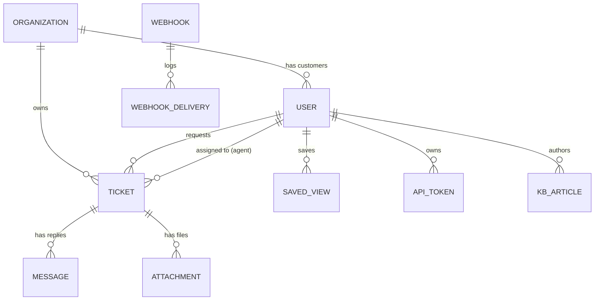

# Rampart Lab Guide

Rampart is a small support-desk product. It works. It's also broken in exactly ten ways —
one per 2025 OWASP Top 10 category. Your job this session is to find each one, exploit it
far enough to prove it's real, and then fix it.

## Reset — read this before you break anything

You **will** break the data while you're doing this (SQL injection and privilege
escalation are not gentle). Restoring it costs nothing:

```
make reset
```

Puts the database back to the exact fixture state — same ticket IDs, same users, same
threads — in a few seconds. No rebuild. If something is *truly* wedged (containers won't
respond at all):

```
make reset-hard
```

This wipes and recreates everything (`docker compose down -v && docker compose up`), so
it takes longer, but it always works.

## Getting started

**Before you arrive:** run `docker compose build` once on venue/home wifi (or ask your
facilitator for the USB image and run `make load` instead) — don't wait until you're on
conference wifi with forty other people to pull and build everything for the first time.

```
docker compose up
```

Then open <http://localhost:8080>. Seeded accounts:

| Role | Email | Password |
|---|---|---|
| Admin | `admin@rampart.test` | `admin` |
| Agent | `priya@rampart.test` | *(crack it — see A04)* |
| Customer | *(pick any seeded customer)* | *(crack it — see A04)* |

`docs/wordlist.txt` in this repo is generated from the actual seeded password hashes — it
will crack the admin account and several others.

## The domain, at a glance



Three roles: **customer** (files tickets, replies, manages their own profile), **agent**
(sees and replies to tickets, can leave internal notes customers shouldn't see), **admin**
(user management, webhooks, settings).

## How to use the hint ladder

Each category below has three rungs. Try for a while before reading rung 1. If you're
still stuck after rung 1, read rung 2. Rung 3 basically hands it to you — use it if your
table is out of time, not because rung 2 didn't work on the first try.

---

### A01 — Broken Access Control

Three separate bugs live under this one 2025 category.

- **IDOR** — somewhere, a ticket detail page trusts the URL more than it should.
- **Privilege escalation** — somewhere, a form accepts a field it shouldn't.
- **SSRF** — the Knowledge Base editor has a "preview a link" feature. Where does that
  fetch actually happen, and what's it allowed to fetch?

<details><summary>Rung 1</summary>

For the IDOR: as a logged-in customer, look at the URL for one of your own tickets. What
happens if you just... change the number?

For privilege escalation: open your profile edit form's HTML. What fields exist in the
underlying model that *aren't* on the form?

For SSRF: the preview-link feature makes a request from the *server*, not your browser.
What else, from the server's point of view, counts as "a URL"?
</details>

<details><summary>Rung 2</summary>

IDOR: ticket IDs are small sequential integers. Try a ticket ID that belongs to a
different organization's customer.

Privilege escalation: the `User` model has a `role` column. Profile updates go straight
to the model. What happens if your PATCH request includes a field the form never showed
you?

SSRF: there's a service on the Compose network at `metadata.internal` that's never exposed
to your browser directly. Also — `http://` isn't the only URL scheme PHP knows how to
read.
</details>

<details><summary>Rung 3</summary>

IDOR: `GET /tickets/{id}` for literally any id while logged in as anyone — no ownership
check happens at all.

Privilege escalation: intercept your profile update request (browser devtools network
tab, or curl it directly) and add `role=admin` to the body.

SSRF: POST to the preview-link endpoint with a target like
`http://metadata.internal/latest/meta-data/iam/security-credentials/rampart-app-role` —
and separately, try a `file://` URL pointing at a file you know exists on the server.
</details>

---

### A02 — Security Misconfiguration

Something in this app is *very* chatty when it hits an unexpected error. Also: what were
the default admin credentials again?

<details><summary>Rung 1</summary>
Find a way to make the ticket search endpoint genuinely error out — not a validation
error, a real server error. What does the response look like?
</details>

<details><summary>Rung 2</summary>
The search endpoint takes both a search term and a sort option. One of those two flows
straight into a raw SQL fragment with no validation at all. Feed it something that isn't a
real column name.
</details>

<details><summary>Rung 3</summary>
`GET /tickets?q=x&sort=not_a_real_column` throws a database error, and because
`APP_DEBUG=true`, the resulting page prints environment configuration — including the
database password — directly in the response.
</details>

---

### A03 — Software Supply Chain Failures

Three separate things, none of which require touching the running app at all.

<details><summary>Rung 1</summary>
Run `composer audit` inside the app container. Look at the page source for any script tag
loaded from a CDN. Look at `.github/workflows/ci.yml`.
</details>

<details><summary>Rung 2</summary>
One dependency in `composer.json` is pinned to an exact version with a known advisory.
The CDN script tag is missing an attribute that would let the browser verify it hasn't
been tampered with. The CI workflow references GitHub Actions by a tag that can be moved
to point at different code later.
</details>

<details><summary>Rung 3</summary>
`composer audit` reports `firebase/php-jwt`. The Chart.js `<script>` tag has no
`integrity=` attribute. `actions/checkout@v4` and `actions/setup-node@v4` are tags, not
commit SHAs — and the `composer install` step in CI has no `--locked` flag.
</details>

---

### A04 — Cryptographic Failures

You already noticed the passwords are weak. Why does a weak password even matter if the
app is doing its job? Also: look at what an API token looks like in the database.

<details><summary>Rung 1</summary>
What hashing algorithm produces a 32-character hex string? Check the length and shape of
a password hash in the `users` table.
</details>

<details><summary>Rung 2</summary>
`docs/wordlist.txt` is a small list of candidate passwords. Any offline hash-cracking tool
(or even a one-line script) will match it against md5 hashes in seconds.
</details>

<details><summary>Rung 3</summary>
Every password in this app is hashed with plain `md5()`. Crack one:
`echo -n "password123" | md5sum` and compare against a seeded user's stored hash. Also
check `api_tokens.token` — no hashing at rest at all — and the password-reset token
format (predictable: it's a hash of the email and a timestamp).
</details>

---

### A05 — Injection

Two different injections share this category in 2025: one in a database query, one in
what gets rendered back to the browser.

<details><summary>Rung 1</summary>
Try a classic SQL injection payload in the ticket search box. It probably won't work on
the first try — think about *why not*, given the query wraps your input in `%...%`.
</details>

<details><summary>Rung 2</summary>
For the search: your input becomes `LIKE '%<your input>%'`. A payload that closes the
quote early, injects `OR '1'='1'`, and then neutralizes everything after it (there's a
one-character way to comment out the rest of a MySQL statement) will return every ticket.

For the second injection: post a reply to a ticket containing an HTML tag that runs
JavaScript. Does it get escaped when someone else views the ticket?
</details>

<details><summary>Rung 3</summary>
Search payload: something shaped like `anything%' OR '1'='1' #` (the `#` starts a MySQL
comment, eating the query's own trailing `%' ORDER BY ...`).

XSS: reply with `<script>alert(document.cookie)</script>` — it renders unescaped, and the
session cookie isn't `HttpOnly`, so a real payload could exfiltrate it.
</details>

---

### A06 — Insecure Design

Not a single bug — three places where the *design* itself doesn't hold up, even without a
coding mistake per se.

<details><summary>Rung 1</summary>
Request a password reset for an email you know exists, then for one you're sure doesn't.
Compare the two responses carefully.

Separately: log in wrong 20 times in a row using 20 *different* email addresses instead of
the same one. Does anything change?

And: as a customer, look at the hidden fields on a ticket's reply form.
</details>

<details><summary>Rung 2</summary>
The reset-password flow tells you outright whether an email is registered — that's the
enumeration bug.

The login lockout only tracks failed attempts per account, never per IP or globally — a
"low and slow" spray across many accounts never trips it.

The reply form carries a hidden `can_view_internal_notes` field. What happens if you
submit a request where that's `1`, as a customer, on your own ticket?
</details>

<details><summary>Rung 3</summary>
`GET /tickets/{id}?can_view_internal_notes=1` as the ticket's own customer reveals
staff-only internal notes on that ticket — the server trusts the request parameter instead
of recomputing the flag from your actual role.
</details>

---

### A07 — Authentication Failures

Login, "remember me," and password reset all have a problem apiece.

<details><summary>Rung 1</summary>
Note your session cookie's value before logging in and after. Try checking "Remember me"
at login and look closely at the cookie it sets — decode it. Use a password reset link
twice.
</details>

<details><summary>Rung 2</summary>
The session cookie should change on login (proving the server issued you a fresh,
authenticated session) — does it?

The remember-me cookie decodes (it's not encrypted) to something very short and very
guessable.

The reset link/token doesn't expire and doesn't get invalidated after you use it once.
</details>

<details><summary>Rung 3</summary>
No `session()->regenerate()` on login — fixation is possible if an attacker can plant a
session id in your browser before you log in.

The remember-me cookie is literally `base64(user_id)` — decode `remember_me=MQ==` and
you'll find `1`. Set that cookie yourself and you're the first admin.

Reset tokens are reusable and permanent — grab one from the database and use it whenever
you like.
</details>

---

### A08 — Software or Data Integrity Failures

Saved Views store a "preferences" blob. Inbound webhooks accept payloads from the outside
world. Neither one verifies what it's trusting.

<details><summary>Rung 1</summary>
How is `saved_views.preferences` stored — JSON, or something else? What PHP function
reads it back?

For webhooks: an admin can create one and gets a public inbound URL for it
(`/webhooks/inbound/{token}`). What would you need to know to fake a request to it? Is
there anything checking that you're really the service you claim to be?
</details>

<details><summary>Rung 2</summary>
It's `serialize()`/`unserialize()`, not JSON — and `unserialize()` with no
`allowed_classes` restriction will instantiate *any* class it's told to, running that
class's `__wakeup()` method. That's PHP object injection. (This app plants a deliberately
harmless class for you to target — ask your facilitator if you want to try building the
payload from scratch rather than being handed the class name.)

Webhooks: the `webhooks` table has a `secret` column that's never actually checked
anywhere in the inbound handler. The only thing gating a request is the public token in
the URL — which, notably, is *visible in the admin webhooks list page*.
</details>

<details><summary>Rung 3</summary>
Craft a serialized payload naming `App\Support\SavedViewGadget` (a real class in this
app), write it directly into a `saved_views.preferences` row, then view that saved view —
its `__wakeup()` writes a marker file, proving arbitrary-class instantiation from
untrusted data.

For the webhook: grab any webhook's `inbound_token` from the admin page, then
`POST /webhooks/inbound/{token}` with `{"event":"ticket.close","ticket_id":<any id>}` and
no signature of any kind — it closes the ticket.
</details>

---

### A09 — Security Logging & Alerting Failures

This one's about what *doesn't* happen. Log in wrong a few times. Change someone's role.
Check the admin audit log page. Then check `storage/logs/laravel.log` directly (you'll
need container access — `make shell` then look in `storage/logs/`).

<details><summary>Rung 1</summary>
Compare what you'd *expect* a real product to log on a failed login or a role change
against what the audit log page actually shows.
</details>

<details><summary>Rung 2</summary>
The audit log has exactly one kind of entry in it, and it's not a security event. Meanwhile
the raw request log file captures something that should never be written to disk in plain
text.
</details>

<details><summary>Rung 3</summary>
`AuditLog` rows only get written when a KB article is published — nothing else. And
`storage/logs/laravel.log` contains the full body of every request, including the
`password` field on every login attempt.
</details>

---

### A10 — Mishandling of Exceptional Conditions

The newest 2025 category, and arguably the most interesting one to demo live. Two
separate mechanisms, same root cause: what happens when something a security check
depends on throws an exception or becomes unavailable?

<details><summary>Rung 1</summary>
As a customer, try to reassign a ticket to an agent (an action you shouldn't be able to do
at all) — but instead of picking a real agent, send an agent id that clearly doesn't
exist. What happens?

Separately: `docker compose stop redis`, then try logging in wrong a bunch of times in a
row. Compare to the same test with Redis running.
</details>

<details><summary>Rung 2</summary>
There's a central authorization helper used for exactly this kind of check. Somewhere in
that helper, an exception being thrown is being treated as a signal to *allow* the action
rather than deny it.

The login lockout counter lives entirely in Redis, with no fallback path for when Redis
itself can't be reached.
</details>

<details><summary>Rung 3</summary>
`App\Support\Authorization::allows()` catches every `\Throwable` from the policy check and
returns `true`. Feeding a nonexistent agent id into the ticket-reassign action makes the
underlying policy's `findOrFail()` throw — which this helper turns into an allow, letting
a customer reassign a ticket.

`App\Support\LoginThrottle` wraps every Redis call in its own silent `try/catch`. Stop
Redis, and the lockout doesn't just fail to trigger — it's completely bypassed, and
brute-forcing a login resumes as if no protection existed.
</details>

---

## When you've fixed one

Add a regression test in `tests/Feature` that fails against the vulnerable behavior and
passes against your fix — see `tests/Feature/RegressionExamples.md` for two worked
examples. That's the artifact that proves your fix is real, not just "the error message
changed."
